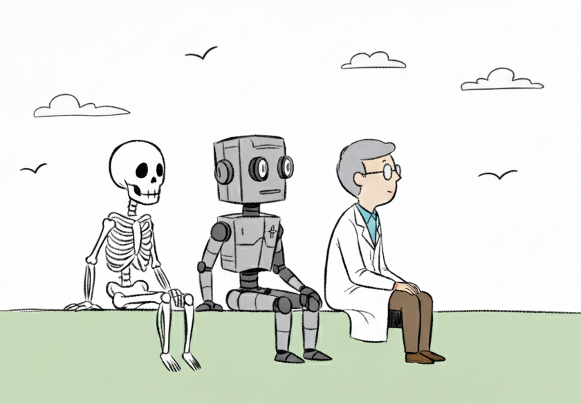

# A Curated Guide to AI in Medical Imaging and Healthcare

Artificial Intelligence (AI) in medical imaging, and in healthcare more broadly, is advancing fast and is already being [deployed in clinical practice](https://jamanetwork.com/journals/jama/fullarticle/2840175). To help anyone trying to learn or navigate this field, I have been curating this guide throughout my PhD. As a disclaimer, this is a personal selection of resources I found particularly useful but is not exhaustive nor claims to represent the best selection. Suggestions for additions are welcome! 

## Key Papers
- [AI, Health, and Health Care Today and Tomorrow (2025)](https://jamanetwork.com/journals/jama/fullarticle/2840175) - On evaluation and regulatory needs for clinical deployment.
- [AI in health and medicine (2022)](https://www.nature.com/articles/s41591-021-01614-0) — Overview of challenges and opportunities
- [Generative artificial intelligence in medicine (2025)](https://www.nature.com/articles/s41591-025-03983-2) — Trends and applications of models that generate images, text, or other data modalities to assist clinicians.
- [Artificial Intelligence in Healthcare: 2024 Year in Review](https://www.medrxiv.org/content/10.1101/2025.02.26.25322978v2) — Trends and advances (mainly in research) from last year 
- [Foundation Models in Radiology: What, How, Why, and Why Not (2025)](https://pubs.rsna.org/doi/10.1148/radiol.240597) —  Role of large-scale, general, pre-trained models in radiology.
- [Convolutional networks and applications in vision (2010)](https://ieeexplore.ieee.org/document/5537907) —  Comprehensive overview of CNNs, the core type of neural network for image-related tasks (a.k.a. computer vision)
- [U-Net: Convolutional Networks for Biomedical Image Segmentation (2015)](https://arxiv.org/abs/1505.04597) —  Seminal paper introducing the most influential neural network architecture for image-to-image tasks.
- [Attention Is All You Need (2017)](https://arxiv.org/abs/1706.03762) —  Seminal paper introducing the architecture that enabled Large Language Models (LLMs), transformers.
- [Transformers in medical imaging: A survey (2023)](https://www.sciencedirect.com/science/article/pii/S1361841523000634) —  Review of transformer applications in computer vision and medical imaging.
- [nnU-Net Revisited: A Call for Rigorous Validation in 3D Medical Image Segmentation (2024)](https://link.springer.com/chapter/10.1007/978-3-031-72114-4_47) — Critical comparison of CNNs and vision transformers.
- [Visualizing the loss landscape of neural nets (2017)](https://arxiv.org/abs/1712.09913) — A bit more of a technical perspective on how neural networks learn.
- [Evaluation metrics in medical imaging AI: fundamentals, pitfalls,
misapplications, and recommendations (2025)](https://www.sciencedirect.com/science/article/pii/S3050577125000283?via%3Dihub) — Choice of metrics must align with clinical goals.
- [Navigating the landscape of multimodal AI in medicine: a scoping review on technical challenges and clinical applications (2024)](https://arxiv.org/abs/2411.03782) — Review of multimodal AI (integration of images, electronic health records, specific biomarkers, etc.)
- [Transparency of medical artificial intelligence systems (2025)](https://www.nature.com/articles/s44222-025-00363-w) - Review of interpretability and transparency methods across inputs, methods, and outputs, crucial elements for clinical adoption.
- [Addressing fairness issues in deep learning-based medical image analysis: a systematic review (2024)](https://www.nature.com/articles/s41746-024-01276-5) — Review on addressing model bias resulting from training on limited or population-specific data.
- [Randomised controlled trials evaluating artificial intelligence in clinical practice: a scoping review (2024)](https://www.thelancet.com/journals/landig/article/PIIS2589-7500(24)00047-5/fulltext) — Analysis on translating research into clinical deployment.
- [Beyond Assistance: The Case for Role Separation in AI-Human Radiology Workflows (2025)](https://pubs.rsna.org/doi/10.1148/radiol.250477) — Discussion of AI-human integration strategies in the clinic.
- [The fragile intelligence of GPT-5 in medicine (2025)](https://www.nature.com/articles/s41591-025-04008-8) - Newer models still hallucinate, are overconfident, and bypass security measures, limiting their clinical use.

You can also find great resources (mostly focusing on regulatory aspects) here: [Stay Informed: Artificial Intelligence & Human Participant Research, by Harvard Catalyst](https://catalyst.harvard.edu/regulatory/ai-human-participant-research/)

## Staying Updated 
- **Tools:** [Stork](https://www.storkapp.me/) (alerts to keep track of new publications), [Doctor Penguin Newsletter](https://doctorpenguin.substack.com) (weekly newsletter with exciting new articles)
- **Journals:** [npj Digital Medicine](https://www.nature.com/npjdigitalmed/), [Radiology: Artificial Intelligence](https://pubs.rsna.org/journal/ai) 
- **Conferences:** MICCAI (key for [biomedical AI challenges](https://miccai.org/index.php/special-interest-groups/challenges/miccai-registered-challenges/) and [impactful papers](https://papers.miccai.org/miccai-2024/)), NeurIPS 
- **Regulatory:** [FDA-approved AI medical devices](https://www.fda.gov/medical-devices/software-medical-device-samd/artificial-intelligence-and-machine-learning-aiml-enabled-medical-devices)
- **Events**: Often an underrated way to meet people and learn about the field. You can find them mainly on [Meetup](https://www.meetup.com/) or [Eventbrite](https://www.eventbrite.com/).

## Courses and Talks 
- Harvard’s [AI in Medicine (2025)](https://zitniklab.hms.harvard.edu/AIM2/) (structured, with great references)
- Coursera/Udacity: e.g., [AI for Medicine Specialization ()](https://www.coursera.org/specializations/ai-for-medicine). 
- [AI in Healthcare Implementation Playbook (2025)](https://dimesociety.org/ai-implementation-in-healthcare-playbook/)
- [Voxel51’s YouTube channel](https://www.youtube.com/@voxel51/videos) uploads computer vision research talks. Also, I recommend this [presentation (2025)](https://www.youtube.com/watch?v=ogEkl-FC0dI) by Dr. Arman Rahmim on the importance of physician-centered design. 

## Books 
- [Deep Medicine (2019)](https://drerictopol.com/portfolio/deep-medicine/) by Eric Topol is a fantastic, accessible introduction. 
- [Understanding Deep Learning (2023)](https://udlbook.github.io/udlbook/) by Simon Prince is the best and most comprehensive technical reference for artificial intelligence that I have found. 
- [Deep Learning for Biology (2025)](https://www.amazon.co.uk/dp/1098168038) by Charles Ravarani and Natasha Latysheva, with several chapters on medical applications. It has an accompanying [repo](https://github.com/deep-learning-for-biology/notebooks) with notebook examples.

## Hands-on Learning 
I feel like trying out some of these models is the best way to learn, so I recommend: 
- Installing and testing [nnUNet](https://github.com/MIC-DKFZ/nnUNet), the gold standard for medical image segmentation. Also check out [TotalSegmentator](https://github.com/wasserth/TotalSegmentator) or MedSAM. 
- To find models and share projects, GitHub is where it’s at. 
- Attempting Kaggle challenges, such as [this one on cervical fracture detection](https://www.kaggle.com/competitions/rsna-2022-cervical-spine-fracture-detection), where you can guide yourself using other participants’ solutions - To code and test models, try Google Colab ([tutorial 1](https://colab.research.google.com/drive/16pBJQePbqkz3QFV54L4NIkOn1kwpuRrj) and [tutorial 2](https://www.marqo.ai/blog/getting-started-with-google-colab-a-beginners-guide)).
- An open-source framework to easily train AI models for medical tasks is [MONAI](https://monai.io/).
- Data are essential to start any project: The [Medical Image Database](https://www.cuilab.cn/medimg/) ([paper](https://academic.oup.com/gpb/advance-article/doi/10.1093/gpbjnl/qzaf068/8238507?login=false)) includes an extensive collection, the [Awesome-Medical-Dataset](https://github.com/openmedlab/Awesome-Medical-Dataset) keeps track of many existing datasets, and others can be found in [Dataset Ninja](https://datasetninja.com/category/medical), [Google](https://datasetsearch.research.google.com/), or [TCIA](https://www.cancerimagingarchive.net/) (cancer-related). 

## People to Follow on LinkedIn 
- [Jan Beger](https://www.linkedin.com/in/janbeger/) —  Head of AI Advocacy, GE HealthCare
- [Woojin Kim](https://www.linkedin.com/in/woojinkim/) — Researcher and radiologist
- [Pranav Rajpurkar](https://www.linkedin.com/in/pranavrajpurkar/) — Researcher and biomedical AI entrepreneur
- [Ethan Mollick](https://www.linkedin.com/in/emollick/) — Communicator on general AI topics 
- [Matthew Lungren](https://www.linkedin.com/in/mattlungrenmd/) — Chief Scientific Officer, Microsoft Health
- [Michael Howell](https://www.linkedin.com/in/mdhowell/) — Chief Clinical Officer, Google
- [Taha Kass-Hout](https://www.linkedin.com/in/tahak/) — Chief Technology Officer, GE HealthCare

## Contributions
Feel free to open an issue, submit a pull request, or email me at pablocabrales8@gmail.com for suggestions or additions!

## Previous Contributions 
These have been substituted by more recent resources, but might still be useful:
- [Survey of Explainable AI Techniques in Healthcare (2023)](https://www.mdpi.com/1424-8220/23/2/634)

---
